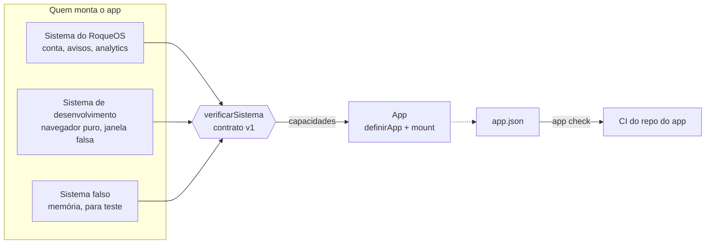

# app-sdk

O contrato entre o [RoqueOS](https://roqueos.com.br) e um app. Um app exporta
`mount(el, sistema)`; o `sistema` entrega capacidades (quem está usando, em que idioma, onde
guardar o que é do app, como avisar alguma coisa na tela) e é só por elas que o app fala com o
RoqueOS. O mesmo app roda dentro do RoqueOS, sozinho no navegador e no teste, sem saber em
qual dos três está.

_English below._

## Por que existe

Os apps do RoqueOS (Calculadora, Notas, QR Code, Música e outros, 32 ao todo) nasceram dentro do
repositório do sistema, que é fechado, e importavam as stores dele direto. A partir de
27/09/2026 eles começam a sair, cada um para um repo próprio na organização
[roqueos-apps](https://github.com/roqueos-apps), abertos sob MIT. Este SDK é o que torna isso
possível: o app depende dele, e não do RoqueOS. É o irmão do
[`jogo-sdk`](https://github.com/roqueos-games/jogo-sdk), que fez o mesmo com os jogos: mesma
forma, mesmas regras, capacidades de app em vez de capacidades de jogo.

## Arquitetura



- `definirApp({ id, capacidades, montar })` cria o app. `mount` confere o sistema antes de
  montar e recusa, com a lista do que falta, o sistema que não cumpre o contrato.
- `montar(el, sistema, { windowId, ativo })` recebe o elemento onde o app vive e cria **o
  próprio app Vue** (ou o que for) dentro dele. Nenhuma store, nenhum plugin e nenhum estilo
  global do RoqueOS chega lá dentro. Devolve `{ ativar(ativo), desmontar() }`.
- `verificarSistema(sistema)` diz o que falta: capacidade ausente, forma errada, versão de
  contrato diferente. Todos os problemas de uma vez.
- `validarManifesto(appJson)` confere o `app.json`.
- `app check` confere um repo de app inteiro (a lista está em [Regras](#regras)).

### As capacidades do contrato v1

Estão em [`src/contrato.js`](src/contrato.js), cada uma com o motivo de existir. O motivo é
parte do contrato: capacidade sem motivo vira atalho para o app alcançar o que não devia.

| Capacidade      | Forma                              | Para quê                                                                            |
| --------------- | ---------------------------------- | ----------------------------------------------------------------------------------- |
| `identidade`    | `atual()`, `aoMudar(fn)`           | `{ uid, nome }`, ou `{ uid: null, nome: null }` para convidado                      |
| `avisar`        | `avisar(mensagem, { tipo, fixo })` | o que a pessoa precisa ler; `fixo: true` fica até ela fechar                        |
| `idioma`        | `atual()`, `aoMudar(fn)`           | um dos dez idiomas; a troca chega com a janela aberta                               |
| `desempenho`    | `modoLeve()`                       | o aparelho pede o perfil leve: sem efeito que segue o sensor, sem animação contínua |
| `metricas`      | `evento(nome, dados)`              | uso, com nomes de evento que não mudam sem motivo                                   |
| `armazenamento` | `ler`, `gravar`, `apagar`          | texto no espaço `roqueos:<app>:<chave>`, no aparelho                                |

As seis vêm do `jogo-sdk`, que as prova em vinte jogos. Capacidade nova (`arquivos`,
`abrirCom`, `servidor`, `ia`, câmera) nasce **opcional**, na onda do primeiro app que precisa
dela, com motivo escrito. Mudar a forma de uma que existe é versão nova do contrato, e o
sistema recusa o app que pede outra versão em vez de quebrar em runtime.

### O manifesto `app.json`

```json
{
  "id": "calculator",
  "versaoDoContrato": 1,
  "camada": "primeira-parte",
  "nome": { "pt-BR": "Calculadora", "en-US": "Calculator", "...": "os dez idiomas" },
  "descricao": { "pt-BR": "Calculadora científica", "...": "os dez idiomas" },
  "icone": "calculate",
  "cor": "#ff9500",
  "categoria": "productivity",
  "janela": {
    "largura": 380,
    "altura": 680,
    "minLargura": 300,
    "minAltura": 540,
    "maximizavel": false
  },
  "capacidades": [],
  "autor": "Roque Ribeiro",
  "licenca": "MIT"
}
```

O `id` é **permanente**: é a chave da janela, do dock e do armazenamento de quem já usa o app.
`camada` é `primeira-parte` (nosso, na mesma origem, com os dez idiomas) ou `comunidade`
(qualquer pessoa, num iframe em outra origem, com pt-BR e en-US obrigatórios). `icone` é o
nome de um Material Icon ou um SVG do repo. Campo que o manifesto não conhece reprova, para um
erro de digitação não ser ignorado em silêncio.

### As variáveis CSS do sistema

Um app de primeira parte está no mesmo documento do RoqueOS e enxerga as custom properties
do tema. Usar uma delas é dependência de verdade que nenhum grafo de build vê, então ela vira
contrato: [`src/variaveis.js`](src/variaveis.js) lista as que um app pode usar
(`--ros-white-rgb`, `--ros-black-rgb`, `--ros-border-dim`, `--ros-text-100`, `--ros-shadow-30`
e `--ros-shadow-50`), o `app check` reprova qualquer
outra, e o RoqueOS tem um teste que reprova se alguma delas sumir do tema. O prefixo `--ros-`
é do sistema: a variável do app usa outro (`--calc-fundo`).

## Regras

O `app check` confere, e reprova sem "aviso":

- **Sem script de instalação** (`preinstall`, `postinstall`, `prepare`...): o RoqueOS instala o
  app como dependência, e o script rodaria na máquina de quem builda.
- **`app.json` válido**, com o ícone SVG existindo no repo.
- **Textos em `i18n/<idioma>.json`**: os dez para primeira parte, pt-BR e en-US para
  comunidade, todos com as mesmas chaves do pt-BR e nenhuma vazia.
- **Cada arquivo de `public/` com linha no `ASSETS.md`**: caminho, licença (CC0-1.0,
  CC-BY-4.0, MIT, BSD-3-Clause ou autoral) e origem.
- **O app não fala com banco**: nada de `firebase` em `src/`. Quem guarda é o sistema.
- **O app não importa o RoqueOS**: nem os apelidos de dentro do sistema (`src/`, `stores/`,
  `boot/`...), nem o Quasar, no JavaScript, no `.vue` e no SCSS. No repo do app esse import
  quebra; dentro do RoqueOS ele compilaria e leria a store inteira calado, e é por isso que o
  RoqueOS roda o mesmo check nos apps que ainda moram nele.
- **Só as variáveis `--ros-*` do contrato**, e nenhuma declarada pelo app.

## Pré-requisitos

- Node 22 ou mais novo (o `.nvmrc` diz 24).
- Yarn 1 (`packageManager` no `package.json`).

## Como rodar

```bash
yarn install --ignore-scripts
yarn verificar        # lint, formato, testes e app check, o mesmo do CI e do pre-push
yarn test             # só os testes (node:test, sem dependência)
node bin/app.mjs check caminho/do/app   # o app check num repo de app
```

Num repo de app, o SDK entra como dependência git pinada por tag, sem registro de pacote:

```json
{ "dependencies": { "@roqueos-apps/app-sdk": "github:roqueos-apps/app-sdk#v0.1.0" } }
```

e o `yarn dev` monta o app na janela falsa:

```js
import { montarNaJanelaFalsa } from '@roqueos-apps/app-sdk/sistema-de-desenvolvimento'
import manifesto from '../app.json'
import app from '../src/index.js'

montarNaJanelaFalsa(app, { manifesto })
```

A janela tem o tamanho do `app.json`, o nome no idioma atual e um seletor dos dez idiomas. O
árabe vira da direita para a esquerda, como no RoqueOS, e `?idioma=ja-JP` na URL abre direto
em outro idioma, e `?leve=1` mostra o app como o aparelho fraco vê. No teste, `criarSistemaFalso()` devolve o `sistema` e o que o app fez
(`registro.avisos`, `registro.eventos`), e troca idioma e conta com a janela aberta
(`mudarIdioma`, `mudarIdentidade`).

## Estrutura

```text
src/
  contrato.js       as capacidades, com forma e motivo, e verificarSistema
  index.js          definirApp e o que o pacote exporta
  manifesto.js      validarManifesto, categorias e camadas
  variaveis.js      as variáveis CSS do sistema que um app pode usar
  verificacao.js    o que o app check confere
  idiomas.js        os dez idiomas e normalizarIdioma
  e2e.js            emModoE2E e estadoE2E, para o harness de teste de ponta a ponta
  host/
    armazenamento.js  o espaço roqueos:<app>:<chave>
    desenvolvimento.js  o sistema com o navegador puro, e a janela falsa
    falso.js          o sistema em memória, para teste
bin/app.mjs         o app check
test/               node:test, com um app de exemplo em fixtures/app-ok
```

## Onde ele se encaixa na família

O RoqueOS (`roqueos-front`, fechado) implementa o sistema de primeira parte por cima das
stores dele e instala cada app como dependência git pinada por tag. O app nunca vê o
RoqueOS; o RoqueOS nunca importa de dentro do app além do `mount`. A ordem de mudança entre
os lados está no grafo do `roqueos-kit` (`roqueos-graph blast`): o SDK muda primeiro, o
sistema do RoqueOS acompanha, os apps sobem de versão por último.

## Contribuir

Leia o [CONTRIBUTING.md](CONTRIBUTING.md). Todo commit leva `Signed-off-by` (DCO), e o CI
confere. Falha de segurança vai pelo [SECURITY.md](SECURITY.md), nunca por issue pública.

## Licença

[MIT](LICENSE). O nome e a marca RoqueOS são da LEVELHARD e não fazem parte da licença.

---

## English

`app-sdk` is the contract between [RoqueOS](https://roqueos.com.br), a desktop operating
system that runs in the browser, and an app. An app exports `mount(el, system)`: the system
hands it capabilities, and the app talks to RoqueOS only through them. The same app runs
inside RoqueOS, on its own in the browser, and in tests, without knowing which one it is in.

RoqueOS apps are leaving the closed core repository for their own open repositories under the
[roqueos-apps](https://github.com/roqueos-apps) organization, and this SDK is what they depend
on instead of RoqueOS. It is the sibling of `jogo-sdk`, which did the same for games.

- `definirApp({ id, capacidades, montar })` defines an app; `mount` verifies the system first
  and refuses one that breaks the contract, listing every problem.
- `montar(el, sistema, { windowId, ativo })` creates the app's own Vue app inside `el` and
  returns `{ ativar, desmontar }`. No RoqueOS store, plugin or global style reaches inside.
- Contract v1 has six capabilities, taken from `jogo-sdk`, which proves them in twenty games:
  `identidade`, `avisar`, `idioma`, `desempenho`, `metricas` and `armazenamento`. New
  capabilities are born optional, with a written reason, in the wave of the first app that
  needs them.
- `app.json` declares the permanent `id`, name and description in the ten languages (first
  party) or in pt-BR and en-US (community), icon, colour, category, window size, layer,
  author and licence. Unknown fields fail.
- `app check` fails on install scripts, an invalid manifest, missing or empty translations,
  assets without licence and origin in `ASSETS.md`, Firebase imports, imports of RoqueOS
  internals (`src/`, `stores/`, Quasar) in JavaScript, `.vue` or SCSS, and `--ros-*` CSS
  variables outside the contract list.

Run `yarn install --ignore-scripts` and `yarn verificar`; CI runs the same command. An app
repository depends on the SDK as a git dependency pinned by tag
(`"@roqueos-apps/app-sdk": "github:roqueos-apps/app-sdk#v0.1.0"`), with no package registry. In
an app repository, `montarNaJanelaFalsa(app, { manifesto })` from
`@roqueos-apps/app-sdk/sistema-de-desenvolvimento` mounts the app in a fake RoqueOS window with
a language picker, including right-to-left Arabic.

Code, comments and commits are in Brazilian Portuguese, the canonical language of the project;
English issues and pull requests are welcome. Every commit must be signed off (DCO). Licensed
under [MIT](LICENSE); the RoqueOS name and brand belong to LEVELHARD and are not covered.
