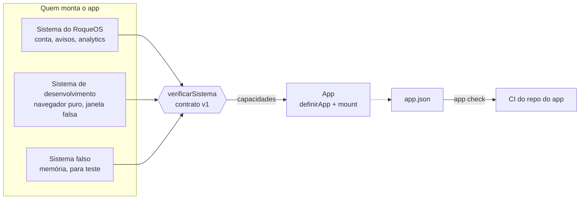

# app-sdk

O contrato entre o [RoqueOS](https://roqueos.com.br) e um app. Um app exporta
`mount(el, sistema)`; o `sistema` entrega capacidades (quem está usando, em que idioma, onde
guardar o que é do app, como avisar alguma coisa na tela) e é só por elas que o app fala com o
RoqueOS. O mesmo app roda dentro do RoqueOS, sozinho no navegador e no teste, sem saber em
qual dos três está.

_English below._

## Por que existe

Os apps do RoqueOS (Calculadora, Notas, QR Code, Música e outros, 32 ao todo) nasceram dentro do
repositório do sistema, que é fechado, e importavam as stores dele direto. A partir de
27/09/2026 eles começam a sair, cada um para um repo próprio na organização
[roqueos-apps](https://github.com/roqueos-apps), abertos sob MIT. Este SDK é o que torna isso
possível: o app depende dele, e não do RoqueOS. É o irmão do
[`jogo-sdk`](https://github.com/roqueos-games/jogo-sdk), que fez o mesmo com os jogos: mesma
forma, mesmas regras, capacidades de app em vez de capacidades de jogo.

## Arquitetura



- `definirApp({ id, capacidades, montar })` cria o app. `mount` confere o sistema antes de
  montar e recusa, com a lista do que falta, o sistema que não cumpre o contrato.
- `montar(el, sistema, { windowId, ativo })` recebe o elemento onde o app vive e cria **o
  próprio app Vue** (ou o que for) dentro dele. Nenhuma store, nenhum plugin e nenhum estilo
  global do RoqueOS chega lá dentro. Devolve `{ ativar(ativo), desmontar() }`.
- `verificarSistema(sistema)` diz o que falta: capacidade ausente, forma errada, versão de
  contrato diferente. Todos os problemas de uma vez.
- `validarManifesto(appJson)` confere o `app.json`.
- `app check` confere um repo de app inteiro (a lista está em [Regras](#regras)).

### As capacidades do contrato v1

Estão em [`src/contrato.js`](src/contrato.js), cada uma com o motivo de existir. O motivo é
parte do contrato: capacidade sem motivo vira atalho para o app alcançar o que não devia.

| Capacidade      | Forma                                      | Para quê                                                                            |
| --------------- | ------------------------------------------ | ----------------------------------------------------------------------------------- |
| `identidade`    | `atual()`, `aoMudar(fn)`                   | `{ uid, nome }`, ou `{ uid: null, nome: null }` para convidado                      |
| `avisar`        | `avisar(mensagem, { tipo, fixo, titulo })` | o que a pessoa precisa ler; `fixo: true` fica até ela fechar; `titulo` desde 0.2.0  |
| `idioma`        | `atual()`, `aoMudar(fn)`                   | um dos dez idiomas; a troca chega com a janela aberta                               |
| `desempenho`    | `modoLeve()`                               | o aparelho pede o perfil leve: sem efeito que segue o sensor, sem animação contínua |
| `metricas`      | `evento(nome, dados)`                      | uso, com nomes de evento que não mudam sem motivo                                   |
| `armazenamento` | `ler`, `gravar`, `apagar`                  | texto no espaço `roqueos:<app>:<chave>`, no aparelho                                |

As seis vêm do `jogo-sdk`, que as prova em vinte jogos. Capacidade nova nasce **opcional**, na
onda do primeiro app que precisa dela, com motivo escrito. Acrescentar função a uma opcional é
versão menor, porque o app de antes continua servido; tirar função, ou mudar a forma ou o
sentido de uma que existe, é versão nova do contrato, e o sistema recusa o app que pede outra
versão em vez de quebrar em runtime.

#### As opcionais (0.2.0 com as Notas, 0.3.0 com a Lousa, a Câmera, a Captura e os visualizadores)

O app lista em `capacidades` no `app.json` as que usa; o `mount` recusa o sistema que não as
tem, e o `app check` reprova o app que usa uma sem listar. Quando uma falha, ela rejeita com
`ErroDoSistema`, que tem um `codigo` (`sem-conta`, `colecao-desconhecida`,
`campo-do-sistema`, `pasta-invalida`...; a lista está em [`src/erros.js`](src/erros.js)): nunca
finge que deu certo.

| Capacidade | Forma                                                                 | Para quê                                                                                                                             |
| ---------- | --------------------------------------------------------------------- | ------------------------------------------------------------------------------------------------------------------------------------ |
| `colecoes` | `abrir(nome)` → `observar`, `ler`, `criar`, `atualizar`, `apagar`     | documentos na conta da pessoa, em tempo real e em todo aparelho; `ler(id)` traz um só (0.3.0) ([`src/colecoes.js`](src/colecoes.js)) |
| `ia`       | `abrirPainel({ ancora, tipo, contexto, aplicar, aoFechar })`          | o painel de IA do sistema sobre o conteúdo do app; a chave nunca chega ao app ([`src/ia.js`](src/ia.js))                             |
| `arquivos` | `salvar`, `listar(pasta, { tipos })`, `ler(ref)`, `abrirPasta(pasta)` | os Arquivos da pessoa, por pasta e por ref opaca; listar e abrir só a pasta declarada (0.3.0) ([`src/arquivos.js`](src/arquivos.js)) |
| `abertura` | `atual()`, `aoMudar(fn)`                                              | o que quem abriu a janela mandou; o "abrir com" do Finder chega como `{ arquivo }` (0.3.0) ([`src/abertura.js`](src/abertura.js))    |
| `anexos`   | `guardar(blob)` → `{ id }`, `ler(id)`, `apagar(id)`                   | bytes do app na conta, por um id que dura e nunca vira URL: a imagem do quadro da Lousa (0.3.0) ([`src/anexos.js`](src/anexos.js))   |
| `janela`   | `telaCheia(bool)`, `emTelaCheia()`, `aoMudarTelaCheia(fn)`            | a tela cheia feita pelo sistema, que é quem pode escrever no `<html>` (0.3.0) ([`src/janela.js`](src/janela.js))                     |

Em `colecoes`, as datas são do sistema: cada documento chega com `criadoEm` e `atualizadoEm` em
milissegundos, e o app que tenta gravar uma delas recebe `campo-do-sistema`. `atualizar` troca
só os campos enviados, para dois donos escreverem no mesmo documento sem um apagar o do outro
(a nota das Notas é o post-it da área de trabalho). A lista observada segue a conta: entrar e
sair troca o que o app vê sem ele refazer nada, e sem conta gravar rejeita com `sem-conta`. O
app diz no `app.json` os nomes das coleções que abre (`"colecoes": ["notas"]`); o RoqueOS
confere no build que cada uma está no mapa dele, e coleção fora do mapa não abre.

Em `arquivos`, a pasta é um identificador (`Documentos`, `Imagens`, `Videos`), e não um
caminho: onde ela mora e o nome que a pessoa vê são do sistema. Salvar é livre em qualquer pasta
da lista; **listar e abrir no Finder, só a pasta que o app declara em `pastas`** no `app.json`
(a Câmera vê as Imagens, e não a conta inteira). O app nunca vê caminho: `salvar` e `listar`
devolvem uma `ref` opaca, e `ler(ref)` devolve o Blob. A ref vale só para este app nesta sessão
e não se guarda no `armazenamento`; a de ontem rejeita com `ref-invalida`. O "abrir com" do
Finder entrega uma ref pela `abertura` ao app que declara o tipo em `abre`, e esse arquivo o
app lê mesmo sem ter declarado a pasta dele: quem concedeu foi a pessoa, ao escolher o app.

Em `anexos`, o que se guarda é do app, e não um arquivo que a pessoa organiza: a imagem colada
no quadro da Lousa. `guardar(blob)` devolve `{ id }` (`anx_` e 24 letras e dígitos), que o app
guarda dentro do próprio dado e que abre em toda sessão e todo aparelho da pessoa; ao abrir,
`ler(id)` devolve o Blob, com o tipo, e o app desenha por `URL.createObjectURL`. O id é do app
e da conta: o de outro app, o de outra conta e o apagado rejeitam com `nao-encontrado`. **Nunca
há URL durável**: um link do Storage entregue a um app sai pela rede e continua valendo, e o id
só vira bytes passando pelo sistema. Sem conta rejeita com `sem-conta`; acima de 10 MB, com
`grande-demais`, antes de subir um byte.

### O manifesto `app.json`

```json
{
  "id": "calculator",
  "versaoDoContrato": 1,
  "camada": "primeira-parte",
  "nome": { "pt-BR": "Calculadora", "en-US": "Calculator", "...": "os dez idiomas" },
  "descricao": { "pt-BR": "Calculadora científica", "...": "os dez idiomas" },
  "icone": "calculate",
  "cor": "#ff9500",
  "categoria": "productivity",
  "janela": {
    "largura": 380,
    "altura": 680,
    "minLargura": 300,
    "minAltura": 540,
    "maximizavel": false
  },
  "capacidades": [],
  "autor": "Roque Ribeiro",
  "licenca": "MIT"
}
```

Um visualizador de imagem, na 0.3.0, declararia `"capacidades": ["abertura", "arquivos",
"janela"]` e `"abre": ["image/*"]`; a Câmera, `"capacidades": ["arquivos"]` e
`"pastas": ["Imagens"]`.

O `id` é **permanente**: é a chave da janela, do dock e do armazenamento de quem já usa o app.
`camada` é `primeira-parte` (nosso, na mesma origem, com os dez idiomas) ou `comunidade`
(qualquer pessoa, num iframe em outra origem, com pt-BR e en-US obrigatórios). `icone` é o
nome de um Material Icon ou um SVG do repo. `capacidades` lista as opcionais que o app usa, e
`colecoes`, os nomes das coleções que ele abre (obrigatório quando `capacidades` tem
`colecoes`). `pastas` são as pastas que ele lista e mostra no Finder (com `arquivos`), e
`abre`, os tipos que ele abre pelo "abrir com" (`image/*`, `application/pdf`; com `abertura` e
`arquivos`). Campo que o manifesto não conhece reprova, para um erro de digitação não ser
ignorado em silêncio.

### As variáveis CSS do sistema

Um app de primeira parte está no mesmo documento do RoqueOS e enxerga as custom properties
do tema. Usar uma delas é dependência de verdade que nenhum grafo de build vê, então ela vira
contrato: [`src/variaveis.js`](src/variaveis.js) lista as que um app pode usar, o `app check`
reprova qualquer outra, e o RoqueOS tem um teste que reprova se alguma delas sumir do tema. A
lista nasceu com as seis da Calculadora (`--ros-white-rgb`, `--ros-black-rgb`,
`--ros-border-dim`, `--ros-text-100`, `--ros-shadow-30`, `--ros-shadow-50`) e, na 0.2.0,
ganhou as bases que um tema redefine, para o kit de interface acompanhar o tema:
`--ros-text-rgb`, `--ros-fill-rgb`, `--ros-line-rgb`, `--ros-scrim-rgb`, `--ros-shadow-rgb`,
`--ros-surface-0-rgb` e `--ros-danger-rgb`. O prefixo `--ros-` é do sistema: a variável do
app usa outro (`--calc-fundo`).

## Regras

O `app check` confere, e reprova sem "aviso":

- **Sem script de instalação** (`preinstall`, `postinstall`, `prepare`...): o RoqueOS instala o
  app como dependência, e o script rodaria na máquina de quem builda.
- **`app.json` válido**, com o ícone SVG existindo no repo.
- **Textos em `i18n/<idioma>.json`**: os dez para primeira parte, pt-BR e en-US para
  comunidade, todos com as mesmas chaves do pt-BR e nenhuma vazia.
- **Cada arquivo de `public/` com linha no `ASSETS.md`**: caminho, licença (CC0-1.0,
  CC-BY-4.0, MIT, BSD-3-Clause ou autoral) e origem.
- **O app não fala com banco**: nada de `firebase` em `src/`. Quem guarda é o sistema.
- **O app não importa o RoqueOS**: nem os apelidos de dentro do sistema (`src/`, `stores/`,
  `boot/`...), nem o Quasar, no JavaScript, no `.vue` e no SCSS. No repo do app esse import
  quebra; dentro do RoqueOS ele compilaria e leria a store inteira calado, e é por isso que o
  RoqueOS roda o mesmo check nos apps que ainda moram nele.
- **Só as variáveis `--ros-*` do contrato**, e nenhuma declarada pelo app.
- **Opcional usada é opcional declarada**: `sistema.colecoes`, `sistema?.ia`,
  `sistema['arquivos']` ou `{ abertura } = sistema` no `src/` sem o nome em `capacidades` no
  `app.json` reprova. Sem isso o app monta no `yarn dev`, que tem todas, e quebra com
  `undefined` no sistema que não tem aquela, em vez da recusa com motivo do `mount`.
- **Pasta usada é pasta declarada**: `arquivos.listar('Imagens')` ou `abrirPasta('Videos')` no
  `src/` sem a pasta em `pastas` reprova, em vez da recusa `pasta-nao-declarada` só no RoqueOS.

E o repositório do SDK tem uma regra só dele: **a tag de release só em commit que já está na
`main`**. O workflow `tag` roda `bin/tag-na-main.mjs` em todo push de tag `v*` e fica vermelho
quando a tag está fora dela, porque a família pina o SDK por tag, e uma tag num commit de branch
(que um merge por squash nunca leva à `main`) deixa todo mundo pinado num commit órfão.

## Pré-requisitos

- Node 22 ou mais novo (o `.nvmrc` diz 24).
- Yarn 1 (`packageManager` no `package.json`).

## Como rodar

```bash
yarn install --ignore-scripts
yarn verificar        # lint, formato, testes e app check, o mesmo do CI e do pre-push
yarn test             # só os testes (node:test, sem dependência)
node bin/app.mjs check caminho/do/app   # o app check num repo de app
```

Num repo de app, o SDK entra como dependência git pinada por tag, sem registro de pacote:

```json
{ "dependencies": { "@roqueos-apps/app-sdk": "github:roqueos-apps/app-sdk#v0.3.0" } }
```

e o `yarn dev` monta o app na janela falsa:

```js
import { montarNaJanelaFalsa } from '@roqueos-apps/app-sdk/sistema-de-desenvolvimento'
import manifesto from '../app.json'
import app from '../src/index.js'

montarNaJanelaFalsa(app, { manifesto })
```

A janela tem o tamanho do `app.json`, o nome no idioma atual e um seletor dos dez idiomas. O
árabe vira da direita para a esquerda, como no RoqueOS, e `?idioma=ja-JP` na URL abre direto
em outro idioma, e `?leve=1` mostra o app como o aparelho fraco vê. Na janela falsa a pessoa
está entrada numa conta local, e a coleção fica no `localStorage` do app, para continuar depois
do F5; `?convidado=1` mostra o app como o convidado vê, e `?abertura={"nota":"n1"}` abre como
se outro pedaço do sistema tivesse pedido. O painel de IA, que é do RoqueOS, aparece como um
aviso no lugar onde ele abriria, e salvar em Arquivos vira download (e o que a sessão salvou
aparece no `listar`). O app que declara `abre` ganha um "Abrir arquivo" na barra da janela, que
faz o papel do "abrir com" do Finder, e a tela cheia estica a janela falsa (Esc sai).

No teste, `criarSistemaFalso({ pastas })` devolve o `sistema` e o que o app fez
(`registro.avisos`, `registro.eventos`, `registro.arquivos`, `registro.paineis`,
`registro.pastasAbertas`, `registro.telaCheia`), e mexe no mundo em volta como o RoqueOS mexe:
`mudarIdioma`, `mudarIdentidade`, `mudarAbertura`, `colecoes.semear` e `colecoes.guardado`,
`ia.aplicar`/`ia.fechar` para a pessoa usar o painel de IA, `arquivos.semear` e
`arquivos.guardados` para os Arquivos, `abrirCom` para o "abrir com" do Finder,
`telaCheia.sair`/`telaCheia.recusar` para a pessoa e o navegador mexerem na tela cheia, e
`anexos.guardados()` para os anexos. Dois sistemas falsos com o mesmo
`bancoDeAnexos: criarBancoDeAnexos()` são o mesmo app reaberto: o anexo guardado num o outro
lê, que é como o teste prova que o quadro volta com a imagem.

## Estrutura

```text
src/
  contrato.js       as capacidades, com forma e motivo, e verificarSistema
  index.js          definirApp e o que o pacote exporta
  manifesto.js      validarManifesto, categorias e camadas
  variaveis.js      as variáveis CSS do sistema que um app pode usar
  verificacao.js    o que o app check confere
  idiomas.js        os dez idiomas e normalizarIdioma
  e2e.js            emModoE2E e estadoE2E, para o harness de teste de ponta a ponta
  erros.js          ErroDoSistema e os códigos que uma capacidade devolve
  colecoes.js       a semântica de colecoes: carimbos, campos simples, id de documento
  ia.js             o pedido de abrirPainel
  arquivos.js       as pastas, o pedido de salvar, o filtro de tipos e o cofre de refs
  abertura.js       criarAbertura, a abertura que os três sistemas usam
  janela.js         criarTelaCheia, a tela cheia que os três sistemas usam
  anexos.js         o id de anexo, o teto de tamanho e o que guardar confere
  host/
    armazenamento.js  o espaço roqueos:<app>:<chave>
    colecoes-em-memoria.js  colecoes em memória, para o falso e o de desenvolvimento
    arquivos-em-memoria.js  arquivos em memória, com o cofre de refs, para os mesmos dois
    anexos-em-memoria.js  anexos em memória, presos ao app e à conta, para os mesmos dois
    desenvolvimento.js  o sistema com o navegador puro, e a janela falsa
    falso.js          o sistema em memória, para teste
bin/app.mjs         o app check
bin/tag-na-main.mjs a tag de release só em commit da main (o workflow tag roda)
test/               node:test, com um app de exemplo em fixtures/app-ok
```

## Onde ele se encaixa na família

O RoqueOS (`roqueos-front`, fechado) implementa o sistema de primeira parte por cima das
stores dele e instala cada app como dependência git pinada por tag. O app nunca vê o
RoqueOS; o RoqueOS nunca importa de dentro do app além do `mount`. A ordem de mudança entre
os lados está no grafo do `roqueos-kit` (`roqueos-graph blast`): o SDK muda primeiro, o
sistema do RoqueOS acompanha, os apps sobem de versão por último.

## Contribuir

Leia o [CONTRIBUTING.md](CONTRIBUTING.md). Todo commit leva `Signed-off-by` (DCO), e o CI
confere. Falha de segurança vai pelo [SECURITY.md](SECURITY.md), nunca por issue pública.

## Licença

[MIT](LICENSE). O nome e a marca RoqueOS são da LEVELHARD e não fazem parte da licença.

---

## English

`app-sdk` is the contract between [RoqueOS](https://roqueos.com.br), a desktop operating
system that runs in the browser, and an app. An app exports `mount(el, system)`: the system
hands it capabilities, and the app talks to RoqueOS only through them. The same app runs
inside RoqueOS, on its own in the browser, and in tests, without knowing which one it is in.

RoqueOS apps are leaving the closed core repository for their own open repositories under the
[roqueos-apps](https://github.com/roqueos-apps) organization, and this SDK is what they depend
on instead of RoqueOS. It is the sibling of `jogo-sdk`, which did the same for games.

- `definirApp({ id, capacidades, montar })` defines an app; `mount` verifies the system first
  and refuses one that breaks the contract, listing every problem.
- `montar(el, sistema, { windowId, ativo })` creates the app's own Vue app inside `el` and
  returns `{ ativar, desmontar }`. No RoqueOS store, plugin or global style reaches inside.
- Contract v1 has six capabilities, taken from `jogo-sdk`, which proves them in twenty games:
  `identidade`, `avisar`, `idioma`, `desempenho`, `metricas` and `armazenamento`. New
  capabilities are born optional, with a written reason, in the wave of the first app that
  needs them. Version 0.2.0 adds four, born with the Notes app: `colecoes` (real-time
  documents in the user's account; the system stamps `criadoEm`/`atualizadoEm` and
  `atualizar` replaces only the fields sent), `ia` (the system's single AI panel opened inside
  an app element; agent keys never reach the app), `arquivos` (save a file into the user's
  Files, in an allow-listed folder, never overwriting) and `abertura` (what the opener sent,
  and new requests while the window is open). Version 0.3.0, for the Camera, Screen Capture
  and the viewers, lets `arquivos` list, read and show a folder (`Documentos`, `Imagens`,
  `Videos`) through opaque per-session refs, and only the folders the app declares in `pastas`;
  delivers the Finder's "open with" as `{ arquivo }` in `abertura` to apps declaring the type in
  `abre`; adds `colecoes.ler(id)` for one document; adds `anexos`, the app's own bytes in the
  user's account under a durable id that never becomes a URL (the image pasted on a Whiteboard
  board); and adds `janela`, full screen done by the system. A failing capability rejects with an `ErroDoSistema` carrying a `codigo`; it never
  pretends to succeed.
- `app.json` declares the permanent `id`, name and description in the ten languages (first
  party) or in pt-BR and en-US (community), icon, colour, category, window size, layer,
  author and licence. Unknown fields fail.
- `app check` fails on install scripts, an invalid manifest, missing or empty translations,
  assets without licence and origin in `ASSETS.md`, Firebase imports, imports of RoqueOS
  internals (`src/`, `stores/`, Quasar) in JavaScript, `.vue` or SCSS, `--ros-*` CSS
  variables outside the contract list, optional capabilities used in `src/` but not listed
  in `capacidades`, and folders listed or shown in `src/` but not declared in `pastas`. The SDK
  repository itself only tags releases on commits already in `main` (the `tag` workflow runs
  `bin/tag-na-main.mjs`).

Run `yarn install --ignore-scripts` and `yarn verificar`; CI runs the same command. An app
repository depends on the SDK as a git dependency pinned by tag
(`"@roqueos-apps/app-sdk": "github:roqueos-apps/app-sdk#v0.3.0"`), with no package registry. In
an app repository, `montarNaJanelaFalsa(app, { manifesto })` from
`@roqueos-apps/app-sdk/sistema-de-desenvolvimento` mounts the app in a fake RoqueOS window with
a language picker, including right-to-left Arabic.

Code, comments and commits are in Brazilian Portuguese, the canonical language of the project;
English issues and pull requests are welcome. Every commit must be signed off (DCO). Licensed
under [MIT](LICENSE); the RoqueOS name and brand belong to LEVELHARD and are not covered.
